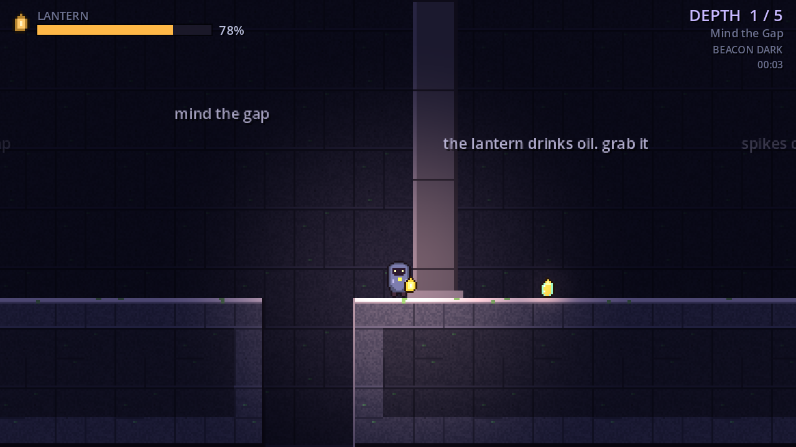
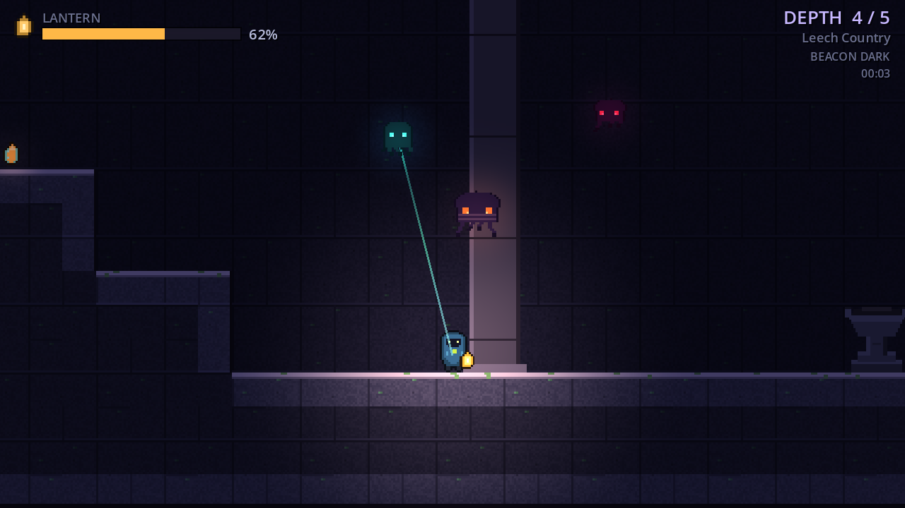
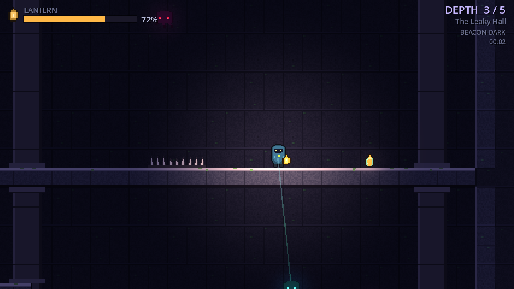

<p align="center">
  
</p>

<p align="center">
  <b>One lantern, five floors of ruin, and a lot of shadows waiting very politely for it to go out.</b>
</p>

<p align="center">
  
  <a href="LICENSE"></a>
</p>

# Haven: the long way down

A small 2D platformer made in Godot 4.7, and the side-view cousin of
[Haven](https://github.com/Bomberman1359/Haven). Same lantern, same shadows,
same music. This time there is no fighting at all. You run, you jump, you keep
the flame fed, and you try to reach the stairs before it gutters.



## How it works

Your lantern burns fuel every second, and the light shrinks as it goes.
Everything that hurts you costs fuel: spikes, drips from the ceiling, the slow
husks, the leeches that sip at your light, even falling into a pit. There are no
hearts. When the fuel hits zero the lantern goes out, and every shadow that
spent the floor politely keeping its distance comes straight for you. That is
the only way to die, and it is very final.

Each floor has one beacon. Stand beside it and hold E. A lit beacon fills your
lantern, keeps a patch of the floor warm, holds your place if things go badly,
and unseals the stairway down. Five floors, and then you are at the bottom.


## Controls

| key | action |
| --- | --- |
| A D / arrows | move |
| SPACE, W or up | jump (hold it for a higher jump) |
| E | hold beside a beacon to light it |
| R | restart the floor |
| ESC | pause |

## The floors

1. **Mind the Gap.** The tutorial, more or less. The walls tell you what to do.
2. **Loose Stones.** Cracked floors that drop out from under you, and the first leech.
3. **The Leaky Hall.** A tall shaft you work your way down while the ceiling drips on your only flame.
4. **Leech Country.** Exactly what it sounds like.
5. **The Last Beacon.** Everything at once, and then the bottom.

## What is down there

| | |
| --- | --- |
| **Wisp** | Circles just outside your light. Harmless while the lantern burns, which is not the same as friendly. |
| **Leech** | Leans into the light and drinks it through a long green straw. Keep moving and it cannot keep up. |
| **Husk** | A slow patrol that ignores your light completely. Bumping into it costs 15 fuel. |



<table>
  <tr>
    <td></td>
    <td></td>
  </tr>
</table>

## Running it

Open this folder in Godot 4.7 and press play. There is nothing else to install.
The project also has a Web export preset, so Project > Export > Web builds a
version that runs in a browser.

## How it is put together

```
src/
  core/      levels.gd holds every floor as rows of characters, one per tile
             game.gd is the hub: builds a floor, runs the fuel, the checkpoint
               and the moment the lantern dies
             hud.gd draws every screen, signs.gd draws the words on the walls
             sfx.gd is an autoload: pooled one-shots plus the looping music
  player/    the lantern keeper: run, jump, coyote time, a buffered jump
  shadows/   wisps, leeches and husks in one script
  world/     terrain.gd draws a floor in one pass; beacons, stairs, oil,
             cracked stone and the leaks in the ceiling
assets/      sprites and sounds, shared with Haven
tools/       the art generators, and a checker for the floors
```

A floor is just text. Here is the start of the first one, gap and all:

```
##................................
##................................
##................................
##..P..........##########...######
#########################...######
```

`#` is stone, `-` is a ledge you can jump up through, `=` is cracked stone,
`^` is spikes, `d` is a leak, `f` is oil, `B` and `S` are the beacon and the
stairs, and `w`, `l`, `h` are the shadows. The full key is at the top of
`src/core/levels.gd`.

## Every floor is checked

```
python3 tools/check_levels.py
```

The checker reads `levels.gd` and flies a pretend player around each floor with
the same gravity and jump as the real one, just a bit slower on its feet. It
fails if the beacon or the stairs cannot be reached, if any oil is out of reach,
or if there is anywhere you can stand and never get out of. It uses the standard
library only.

## The art

Every sprite and every sound, music included, is shared with Haven and comes
out of `tools/gen_sprites.py` and `tools/gen_audio.py`. They make Haven's full
set, so running them also writes a few sprites this game never uses (Haven's
bolt and its bigger shadows). The stone, the spikes, the ledges, the cracks and
the drips are drawn in code at runtime.

## License

MIT, see [LICENSE](LICENSE).
