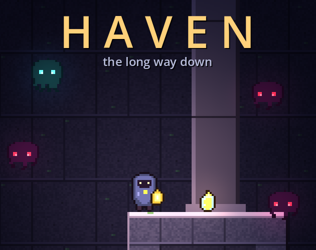
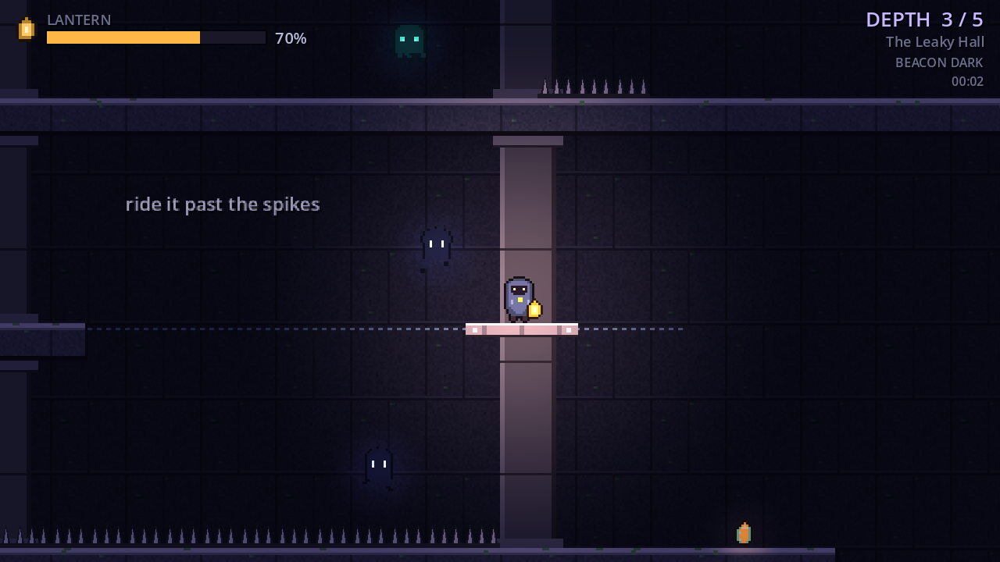
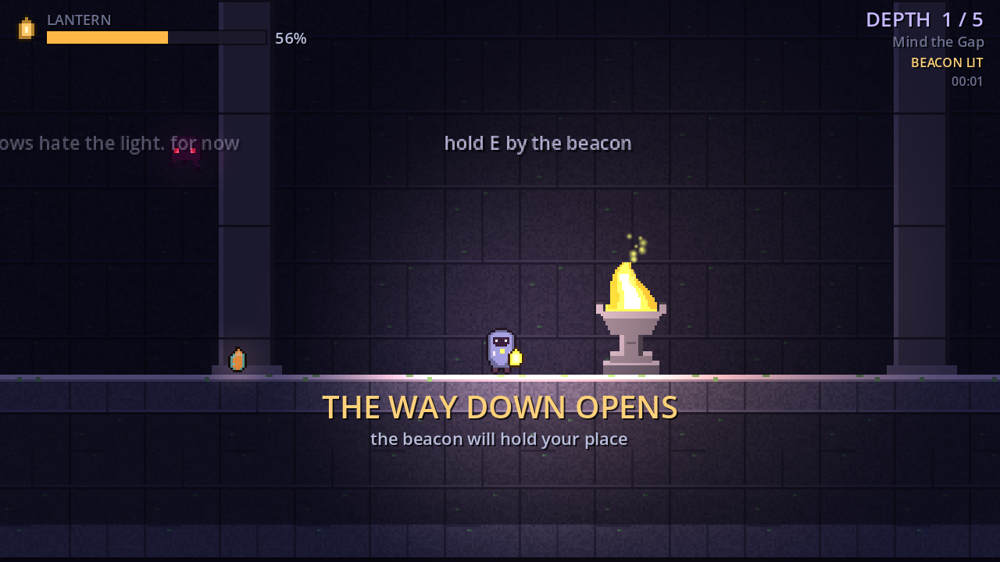
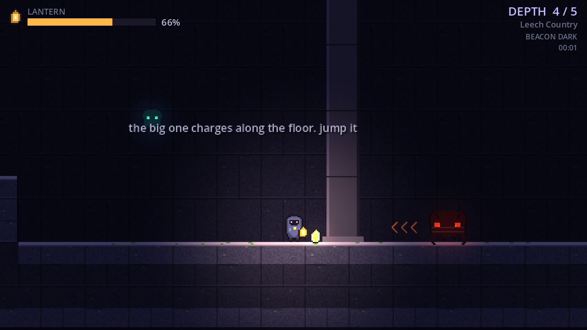
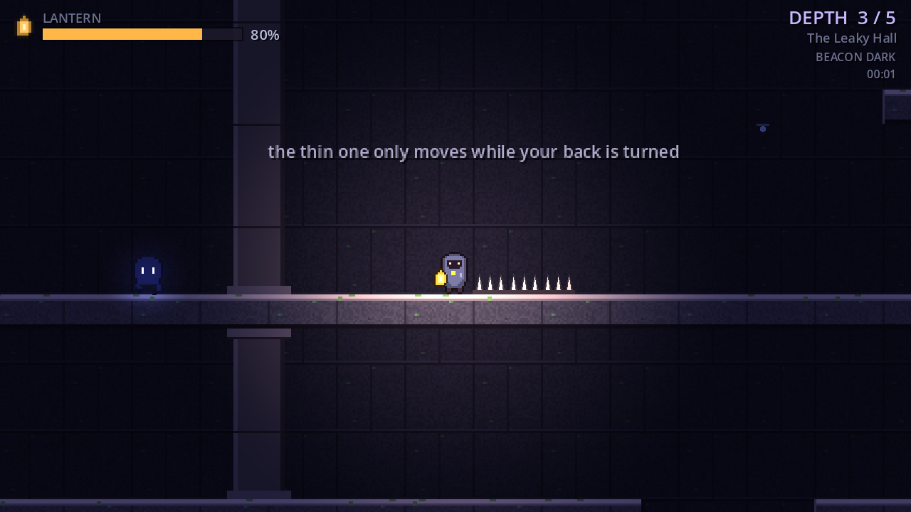
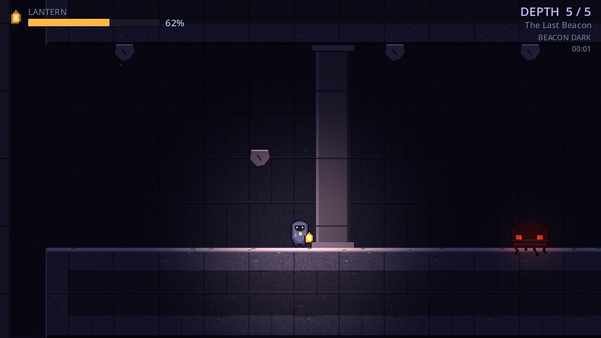
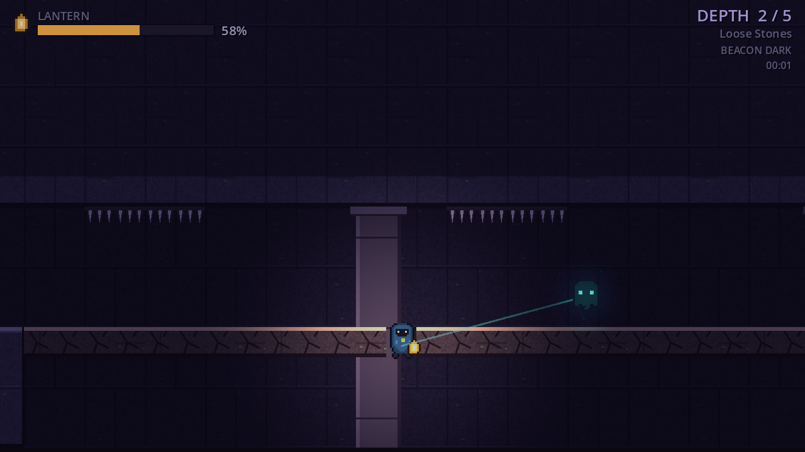
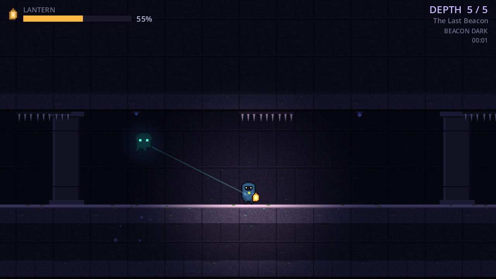
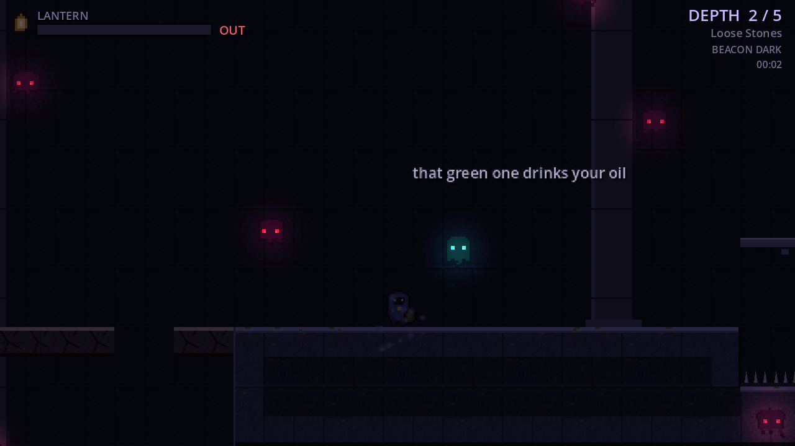

<p align="center">
  
</p>

<p align="center">
  <b>One lantern, five floors of ruin, and a lot of shadows waiting very politely for it to go out.</b>
</p>

<p align="center">
  <a href="https://bomberman1359.itch.io/haven-the-long-way-down"></a>
  
  <a href="LICENSE"></a>
</p>

# Haven: the long way down

A 2D platformer made in Godot 4.7, and the platformer cousin of
[Haven](https://github.com/Bomberman1359/Haven). Same lantern, same shadows,
same music. There is no fighting in this one. You run, you jump, you keep the
flame fed, and you try to reach the stairs before it gutters.

**[Play it in your browser on itch.io](https://bomberman1359.itch.io/haven-the-long-way-down).**
No install, no account.



## How it works

Your lantern burns fuel every second, and the light shrinks as it goes. It also
burns a little faster on every floor. Everything that hurts you costs fuel:
spikes, drips from the ceiling, rocks that let go of it, anything with teeth,
even falling into a pit. There are no hearts. When the fuel hits zero, the
lantern goes out, and every shadow on the floor comes straight for you, plus
nine more that the dark sends along. 

Oil is scarce. There are sixteen flasks in the whole game, 20 fuel each, and a
lot of them sit somewhere slightly annoying.

Each floor has one beacon. Stand beside it and hold E. A lit beacon fills your
lantern, keeps a patch of the floor warm, unseals the stairway down, and holds
your place if things go badly. Five floors, and then you are at the bottom.



## Controls

| key | action |
| --- | --- |
| A D / arrows | move |
| SPACE, W or up | jump (hold it for a higher jump) |
| E | hold beside a beacon to light it |
| R | restart the floor, from the beacon if you lit it |
| ESC | pause |

## The floors

1. **Mind the Gap.** The tutorial. The walls tell you what to do,
   and the last stretch is a ride on a moving slab over a pit.
2. **Loose Stones.** Cracked floors that drop out from under you, rocks that let
   go of the ceiling, the first leeches, and a long tunnel with spikes overhead
   and a floor that crumbles behind you.
3. **The Leaky Hall.** A shaft 98 tiles deep. The ceiling drips on your only
   flame, four stalkers wait on the way down, and past the beacon a slab takes
   you over a spike bed before a lift takes you the rest of the way.
4. **Leech Country.** Seven leeches, two brutes, two husks and a stalker. Three
   rails, one over spikes and two over nothing at all.
5. **The Last Beacon.** A brute alley under five loose stones, a lift up to the
   high road, a dark corridor with spikes in the ceiling, two rails over a pit,
   and one last spike pit to cross on ledges and cracked stone.

From the third floor on, the lantern burns faster

## What is down there

| | |
| --- | --- |
| **Wisp** | Circles just outside your light. Harmless while the lantern burns. |
| **Leech** | Leans into the light and drinks it through a long green straw. It gets thirstier every floor down. Keep moving and it cannot keep up. |
| **Husk** | A slow patrol that ignores your light completely. Bumping into it costs 18 fuel. |
| **Stalker** | Only moves while your back is turned. Look at it and it locks in place. If it reaches you, it takes away 20 fuel. |
| **Brute** | Hangs in the air until you are level with it, winds up for half a second, then charges along the floor. Jump to avoid it. A hit costs 25 fuel. |

<table>
  <tr>
    <td></td>
    <td></td>
  </tr>
</table>

## Things that are not alive and still want your oil

| | |
| --- | --- |
| **Spikes** | 22 fuel. Some of them hang from the ceiling. |
| **Cracked stone** | Holds for about half a second after you land on it, then drops. From the fourth floor on it gives way faster. It grows back after a few seconds. |
| **Loose stones** | Hang in the ceiling, shake when you walk underneath, then fall. 20 fuel if one lands on you. They grow back too, so the same spot can get you twice. |
| **Leaks** | A drop every two seconds or so. 15 fuel if it lands on you. |
| **Slabs and lifts** | Slide along a rail or up and down a shaft. |
| **Pits** | 25 fuel, and you are put back on the last solid ground you stood on. |

<table>
  <tr>
    <td></td>
    <td></td>
  </tr>
  <tr>
    <td></td>
    <td></td>
  </tr>
</table>

## Running it

The quick way is [itch.io](https://bomberman1359.itch.io/haven-the-long-way-down),
right in the browser.

To run it from source, open this folder in Godot 4.7 and press play. There is
nothing else to install. The project also has a Web export preset, so
Project > Export > Web builds the same browser version that is on itch.

## How it is put together

```
src/
  core/      levels.gd holds every floor as rows of characters, one per tile
             game.gd is the hub: builds a floor, runs the fuel, the checkpoint
               and the moment the lantern dies
             hud.gd draws every screen, signs.gd draws the words on the walls
             sfx.gd is an autoload: pooled one-shots plus the looping music
  player/    the lantern keeper: run, jump, coyote time, a buffered jump
  shadows/   wisps, leeches, husks, stalkers and brutes in one script
  world/     terrain.gd draws a floor in one pass; beacons, stairs, oil,
             cracked stone, loose stones, the leaks and the moving slabs
assets/      sprites and sounds, shared with Haven
tools/       the art generators, and a checker for the floors
```

A floor is just text. Here is the end of the first one, with the slab parked at
the left end of its rail:

```
................................................##
..............f..............^^^.........S......##
#####m~~~~~~~~~~~~~~~~~###########################
#####..................###########################
```

`#` is stone, `-` is a ledge you can jump up through, `=` is cracked stone,
`^` and `v` are spikes, `d` is a leak, `F` is a loose stone, `f` is oil, `~` is
a rail with its slab at `m`, `:` is a lift shaft with its lift at `n`, `B` and
`S` are the beacon and the stairs, and `w`, `l`, `h`, `k`, `b` are the shadows.
The full key is at the top of `src/core/levels.gd`.

## Every floor is checked

```
python3 tools/check_levels.py
```

The checker reads `levels.gd` and flies a pretend player around each floor with
the same gravity and jump as the real one, just a bit slower on its feet. Slabs
and lifts count as ledges along their whole run, since you can always wait for
one to come back. It fails if the beacon or the stairs cannot be reached, if any
oil is out of reach, or if there is anywhere you can stand and never get out
of. It uses the standard library only. 

## The art

Every sprite and every sound, music included, is shared with Haven and comes
out of `tools/gen_sprites.py` and `tools/gen_audio.py`. They make Haven's full
set, so running them also writes a few things this game never uses (Haven's
bolt, its flare, its hearts and the splitter). The stone, the spikes, the
ledges, the cracks, the slabs, the loose stones and the drips are drawn in code
at runtime.

## License

MIT, see [LICENSE](LICENSE).
